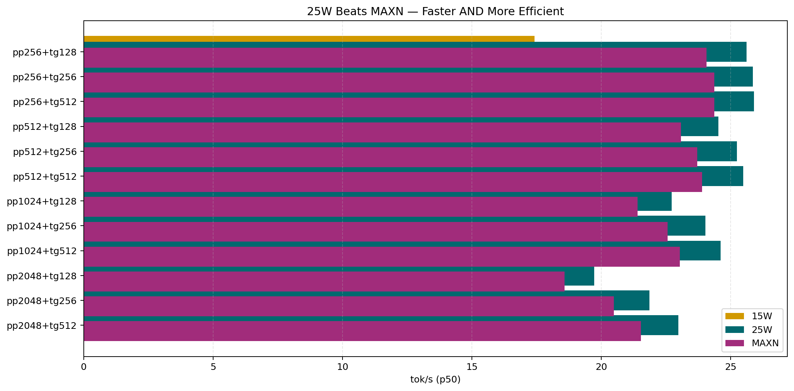
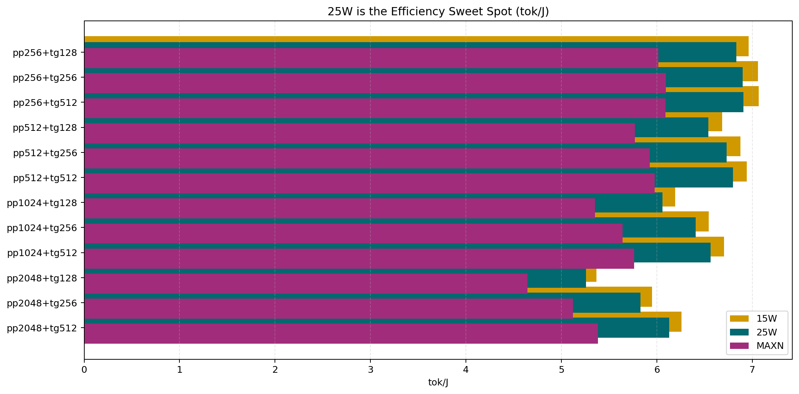
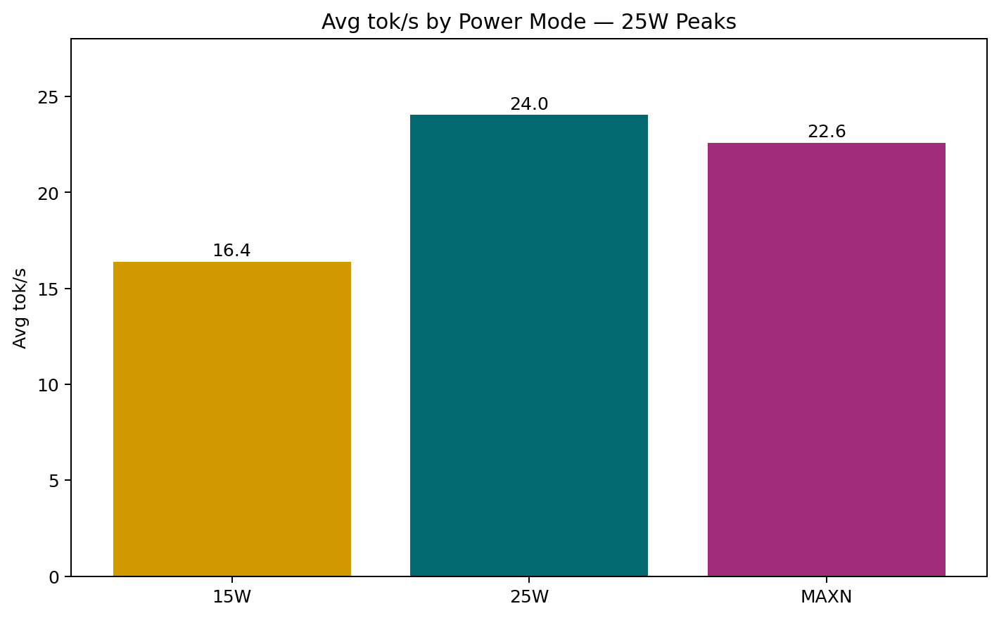
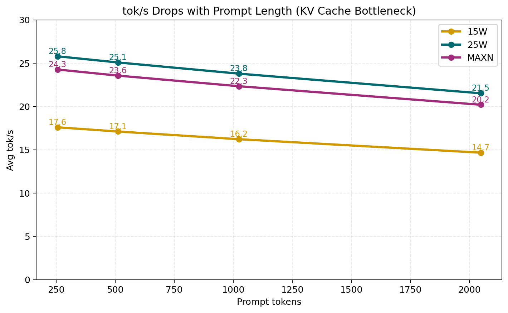

# Bonsai LLM Benchmark on Jetson Orin Nano Super 8GB

> Reproducing and extending [Yuvraj Singh's SmolHub benchmark](https://www.smolhub.com/posts/jetson-orin-nano-super-bonsai-benchmark/) of PrismML's 1-bit and 1.58-bit Bonsai language models across all power modes on the Jetson Orin Nano Super 8GB.

---

## 📋 Table of Contents

- [Hardware & Software Stack](#hardware--software-stack)
- [Repository Structure](#repository-structure)
- [Setup Guide](#setup-guide)
- [Running the Benchmark](#running-the-benchmark)
- [Analysis Scripts](#analysis-scripts)
- [Results (25W — Bonsai-1.7B Q1_0)](#results-25w--bonsai-17b-q10)
- [Key Findings](#key-findings)
- [Formulas & Concepts](#formulas--concepts)
- [References](#references)

---

## Hardware & Software Stack

| Component | Details |
|-----------|---------|
| **Device** | NVIDIA Jetson Orin Nano Super 8GB |
| **JetPack** | 6.2.1 (L4T R36.4.3) |
| **CUDA** | 12.6 |
| **GPU** | Ampere iGPU, SM 8.7, 7619 MiB unified VRAM |
| **CPU** | 6× ARM Cortex-A78AE @ up to 1510 MHz |
| **llama.cpp** | PrismML fork (build b8859-c85e97a44) |
| **Power modes** | 15W · 25W · MAXN_SUPER |

> ⚠️ **Important:** Use the [PrismML fork of llama.cpp](https://github.com/PrismML-Eng/llama.cpp), NOT `ggerganov/llama.cpp`. The standard fork cannot load `Q1_0_G128` quantization with CUDA.

---

## Repository Structure

```
.
├── README.md                              # This file
├── benchmark.py                           # Main benchmark script (llama-server + requests)
├── compare_modes.py                       # Comparison script for 15W / 25W / MAXN_SUPER
├── bonsai_benchmark_report.md             # Benchmark report and notes
├── results/
│   ├── profile_export_15w_bonsai1.7b.jsonl # Timing data for 15W mode
│   ├── profile_export_25w_bonsai1.7b.jsonl # Timing data for 25W mode
│   ├── profile_export_maxn_bonsai1.7b.jsonl # Timing data for MAXN_SUPER mode
│   ├── tegrastats_25w_bonsai1.7b.txt       # VDD_CPU_GPU_CV power log at 25W
│   ├── tegrastats_maxn_bonsai1.7b.txt      # VDD_CPU_GPU_CV power log at MAXN_SUPER
│   ├── bonsai_1.7b_25w_benchmark.png       # Main benchmark results chart
│   ├── compare_tokps.png                  # Throughput comparison chart
│   ├── compare_tokj.png                   # Energy efficiency comparison chart
│   ├── compare_avg_summary.png            # Average throughput summary chart
│   ├── compare_tokps_vs_prompt.png        # tok/s vs prompt length chart
│   ├── compare_tokps.html                 # HTML comparison chart for throughput
│   ├── compare_tokj.html                  # HTML comparison chart for energy efficiency
│   ├── compare_avg_summary.html           # HTML comparison summary chart
│   └── compare_tokps_vs_prompt.html       # HTML comparison chart for prompt length
```

---

## Setup Guide

### 1. Install llama.cpp (PrismML fork)

```bash
git clone https://github.com/PrismML-Eng/llama.cpp
cd llama.cpp
cmake -B build \
  -DGGML_CUDA=ON \
  -DCMAKE_CUDA_ARCHITECTURES=87
cmake --build build --config Release -j4 --target llama-bench
cmake --build build --config Release -j4 --target llama-cli
cmake --build build --config Release -j4 --target llama-server
```

### 2. Verify CUDA Build

```bash
# Check CUDA is linked
ldd ./build/bin/llama-bench | grep -i cuda

# Check GPU is detected
./build/bin/llama-cli --list-devices
# Expected: CUDA0: Orin (7619 MiB, XXXX MiB free)

# Confirm PrismML Q1_0 kernel exists
grep -r "Q1_0" ~/llama.cpp/ggml/src/ggml-cuda/ --include="*.cu" -l
# Expected: mmq-instance-q1_0.cu should appear
```

### 3. Install Dependencies

```bash
sudo apt install -y python3-pip moreutils
pip3 install -U "huggingface_hub[cli]" requests
echo 'export PATH="$HOME/.local/bin:$PATH"' >> ~/.bashrc && source ~/.bashrc
```

### 4. Download Models

```bash
mkdir -p ~/models

# 1-bit Bonsai 1.7B (~237 MB)
huggingface-cli download prism-ml/Bonsai-1.7B-gguf \
  --local-dir ~/models/bonsai-1.7b

# 1.58-bit Ternary Bonsai 1.7B (~300 MB)
huggingface-cli download prism-ml/Ternary-Bonsai-1.7B-gguf \
  --local-dir ~/models/ternary-1.7b

# 1-bit Bonsai 4B (~570 MB) — optional
huggingface-cli download prism-ml/Bonsai-4B-gguf \
  --local-dir ~/models/bonsai-4b
```

---

## Running the Benchmark

### Step 0 — Set Power Mode & Lock Clocks

```bash
# Choose one:
sudo nvpmodel -m 0 && sudo jetson_clocks          # 15W
sudo nvpmodel -m 1 && sudo jetson_clocks          # 25W  ← sweet spot
sudo nvpmodel -m 2 && sudo jetson_clocks          # MAXN_SUPER

# Verify
sudo nvpmodel -q
```

### Step 1 — Quick Sanity Test

```bash
cd ~/llama.cpp
./build/bin/llama-bench \
  -m ~/models/bonsai-1.7b/Bonsai-1.7B-Q1_0.gguf \
  -p 256 -n 128 \
  -ngl 99 \
  -r 3
```

**Expected output:**
```
| qwen3 1.7B Q1_0 | 231.13 MiB | 1.72B | CUDA | 99 | pp256  | ~1358 ± XX |
| qwen3 1.7B Q1_0 | 231.13 MiB | 1.72B | CUDA | 99 | tg128  | ~25.2 ± 0.1 |
```

> The model shows as `qwen3` — this is normal. Bonsai is built on the Qwen3 architecture.

### Step 2 — Start llama-server (Terminal 1)

```bash
cd ~/llama.cpp
./build/bin/llama-server \
  -m ~/models/bonsai-1.7b/Bonsai-1.7B-Q1_0.gguf \
  -ngl 99 \
  --host 0.0.0.0 \
  --port 8080 \
  -c 4096 \
  --parallel 1 \
  --cache-ram 0 \
  --no-mmap
```

Wait for: `main: server is listening on http://0.0.0.0:8080`

### Step 3 — Start Power Logging (Terminal 2)

```bash
mkdir -p ~/results
sudo tegrastats --interval 500 \
  --logfile ~/results/tegrastats_25w_bonsai1.7b.txt &

# Verify it's writing
tail -f ~/results/tegrastats_25w_bonsai1.7b.txt
```

### Step 4 — Run the Benchmark for One Power Mode (Terminal 3)

```bash
python3 benchmark.py
```

Edit the top of `benchmark.py` to set the desired mode tag (for example `15w_bonsai1.7b`, `25w_bonsai1.7b`, or `maxn_bonsai1.7b`) before each run. This executes all **12 combinations** (4 prompt lengths × 3 gen lengths) × 20 requests = **240 total requests** and saves a separate JSONL file for that power mode.

### Step 5 — Repeat for Each Power Mode and Compare

```bash
# Repeat Step 4 for 15W, 25W, and MAXN_SUPER
# Each run writes its own JSONL file:
#   results/profile_export_15w_bonsai1.7b.jsonl
#   results/profile_export_25w_bonsai1.7b.jsonl
#   results/profile_export_maxn_bonsai1.7b.jsonl

python3 compare_modes.py
```

`compare_modes.py` does not run the benchmark itself. It reads the three JSONL files, compares the same prompt/gen combinations across the three power modes, and writes the summary charts and tables to `results/`.

---

## Analysis Scripts

### `benchmark.py`

Orchestrates the full benchmark sweep using `llama-server`'s HTTP API.

```
Arguments (edit top of file):
  SERVER          = "http://localhost:8080"
  PROMPT_TOKENS   = [256, 512, 1024, 2048]
  GEN_TOKENS      = [128, 256, 512]
  NUM_REQUESTS    = 20
  OUTPUT_FILE     = "results/profile_export_25w_bonsai1.7b.jsonl"
```

**Output format** (one JSON per line):
```json
{
  "prompt_tokens": 256,
  "output_tokens": 128,
  "request_start_ns": 1782399126636528300,
  "request_end_ns":   1782399144058580233,
  "latency_s": 4.995,
  "target_prompt_tokens": 256,
  "target_gen_tokens": 128,
  "run": 0
}
```

### `calc_tokj.py`

Calculates `tok/J` by aligning `tegrastats` power readings to each request's time window.

```
Inputs:
  tegrastats_*.txt         — power log from tegrastats
  profile_export_*.jsonl   — request timing from benchmark.py

Output:
  Printed summary table: prompt × gen → tok/s, tok/J, avg power
```

**Formula used:**

```
Energy(J) = Σ (instantaneous_power_W × interval_s)
            for all tegrastats samples within request window

tok/J = output_tokens / Energy(J)
```

---

## Results (25W — Bonsai-1.7B Q1_0)

> Jetson Orin Nano Super 8GB · 25W mode · clocks locked with `jetson_clocks`  
> 20 requests per combo · p50 latency reported · `VDD_CPU_GPU_CV` power rail

| Prompt | Gen | Latency (s) | tok/s | tok/J | Avg Power (W) |
|--------|-----|------------|-------|-------|--------------|
| 256 | 128 | 5.00 | 25.61 | 19.54 | 1.39 |
| 256 | 256 | 9.90 | 25.86 | 14.24 | 1.61 |
| 256 | 512 | 19.77 | 25.90 | 19.76 | 1.45 |
| 512 | 128 | 5.22 | 24.52 | 6.49 | 3.77 |
| 512 | 256 | 10.15 | 25.24 | 6.67 | 3.91 |
| 512 | 512 | 20.09 | 25.48 | 6.78 | 3.77 |
| 1024 | 128 | 5.63 | 22.72 | 5.75 | 3.93 |
| 1024 | 256 | 10.65 | 24.03 | 6.27 | 3.82 |
| 1024 | 512 | 20.80 | 24.61 | 6.52 | 3.85 |
| 2048 | 128 | 6.49 | 19.72 | 4.80 | 4.05 |
| 2048 | 256 | 11.71 | 21.86 | 5.52 | 3.94 |
| 2048 | 512 | 22.28 | 22.98 | 5.94 | 4.10 |


### 3-Mode Comparison (15W vs 25W vs MAXN_SUPER)

The comparison below is generated from [results/compare_tokps.png](results/compare_tokps.png), [results/compare_tokj.png](results/compare_tokj.png), [results/compare_avg_summary.png](results/compare_avg_summary.png), and [results/compare_tokps_vs_prompt.png](results/compare_tokps_vs_prompt.png) by the comparison script.









#### Throughput (tok/s)

| Combo | 15W tok/s | 25W tok/s | MAXN tok/s | 25v15 | MAXv25 |
|---|---:|---:|---:|---:|---:|
| pp256+tg128 | 17.43 | 25.61 | 24.06 | +47.0% | -6.1% |
| pp256+tg256 | 17.66 | 25.86 | 24.37 | +46.4% | -5.8% |
| pp256+tg512 | 17.69 | 25.90 | 24.36 | +46.4% | -5.9% |
| pp512+tg128 | 16.73 | 24.52 | 23.07 | +46.6% | -5.9% |
| pp512+tg256 | 17.21 | 25.24 | 23.71 | +46.6% | -6.1% |
| pp512+tg512 | 17.37 | 25.48 | 23.90 | +46.7% | -6.2% |
| pp1024+tg128 | 15.50 | 22.72 | 21.41 | +46.6% | -5.8% |
| pp1024+tg256 | 16.38 | 24.03 | 22.56 | +46.7% | -6.1% |
| pp1024+tg512 | 16.77 | 24.61 | 23.04 | +46.7% | -6.4% |
| pp2048+tg128 | 13.43 | 19.72 | 18.58 | +46.8% | -5.8% |
| pp2048+tg256 | 14.89 | 21.86 | 20.48 | +46.8% | -6.3% |
| pp2048+tg512 | 15.66 | 22.98 | 21.53 | +46.7% | -6.3% |
| **Average** |  |  |  | **+46.7%** | **-6.1%** |

#### Latency (seconds)

| Combo | 15W p50 | 15W p95 | 25W p50 | 25W p95 | MAXN p50 | MAXN p95 |
|---|---:|---:|---:|---:|---:|---:|
| pp256+tg128 | 7.345 | 7.350 | 4.997 | 5.023 | 5.320 | 5.323 |
| pp256+tg256 | 14.493 | 14.496 | 9.898 | 9.945 | 10.503 | 10.506 |
| pp256+tg512 | 28.948 | 28.957 | 19.770 | 19.787 | 21.015 | 21.023 |
| pp512+tg128 | 7.651 | 7.654 | 5.220 | 5.227 | 5.547 | 5.550 |
| pp512+tg256 | 14.875 | 14.880 | 10.144 | 10.173 | 10.799 | 10.805 |
| pp512+tg512 | 29.470 | 29.478 | 20.090 | 20.114 | 21.424 | 21.430 |
| pp1024+tg128 | 8.260 | 8.270 | 5.634 | 5.636 | 5.979 | 5.987 |
| pp1024+tg256 | 15.627 | 15.636 | 10.654 | 10.660 | 11.347 | 11.352 |
| pp1024+tg512 | 30.523 | 30.531 | 20.802 | 20.811 | 22.221 | 22.232 |
| pp2048+tg128 | 9.531 | 9.557 | 6.491 | 6.507 | 6.891 | 6.905 |
| pp2048+tg256 | 17.189 | 17.216 | 11.713 | 11.726 | 12.500 | 12.504 |
| pp2048+tg512 | 32.687 | 32.710 | 22.277 | 22.300 | 23.776 | 23.872 |

#### Energy efficiency (tok/J)

| Combo | 15W tok/J | 25W tok/J | MAXN tok/J | Best |
|---|---:|---:|---:|---|
| pp256+tg128 | 6.963 | 6.831 | 6.015 | 15W |
| pp256+tg256 | 7.057 | 6.897 | 6.093 | 15W |
| pp256+tg512 | 7.066 | 6.906 | 6.091 | 15W |
| pp512+tg128 | 6.684 | 6.539 | 5.769 | 15W |
| pp512+tg256 | 6.876 | 6.730 | 5.926 | 15W |
| pp512+tg512 | 6.941 | 6.796 | 5.975 | 15W |
| pp1024+tg128 | 6.191 | 6.059 | 5.352 | 15W |
| pp1024+tg256 | 6.545 | 6.408 | 5.640 | 15W |
| pp1024+tg512 | 6.702 | 6.563 | 5.760 | 15W |
| pp2048+tg128 | 5.365 | 5.259 | 4.644 | 15W |
| pp2048+tg256 | 5.950 | 5.828 | 5.120 | 15W |
| pp2048+tg512 | 6.258 | 6.129 | 5.384 | 15W |
| **Average** | **6.550** | **6.412** | **5.647** |  |

#### Sweet-spot summary

- Avg tok/s: 15W = 16.39, 25W = 24.04, MAXN = 22.59
- Avg tok/J: 15W = 6.550, 25W = 6.412, MAXN = 5.647
- 25W vs 15W: +46.7% tok/s and -2.1% tok/J
- MAXN vs 25W: -6.1% tok/s and -11.9% tok/J
- Conclusion: 25W is the sweet spot for this benchmark because it is much faster than 15W while keeping efficiency close to the best observed value.

---

## Key Findings

- **tok/s drops with prompt length** — from 25.6 (pp=256) to 19.7 (pp=2048), confirming O(n²) attention cost scaling with sequence length during the prefill phase increasing KV cache size for decode
- **Power scales with prompt length** — 1.4W at pp=256 vs 4.1W at pp=2048, as longer KV cache is continuously scanned per decode step
- **Cold-start first request** takes ~17s (GPU JIT-compiling kernels) vs ~5s steady state — always discard run 0 or use p50
- **tok/J anomaly at pp=256** — unusually high (19.5–19.8 tok/J) because the model finishes so quickly the GPU barely warms up, keeping average power very low
- **GPU utilisation at 99%** during all decode runs, GPU clock steady at 911 MHz — no thermal throttling observed (peak Tj = 60°C, well below 95°C threshold)

---

## How to Read tegrastats

```
06-25-2026 20:38:18                    ← Timestamp
RAM 4204/7620MB (lfb 11x2MB)           ← used/total RAM, largest free block
CPU [1%@1344, 3%@1344, ...]            ← per-core utilisation @ clock MHz
EMC_FREQ 8%@3199                       ← memory bus utilisation @ MHz
GR3D_FREQ 99%@[911]                    ← GPU utilisation @ actual clock MHz
                                          [brackets] = measured (not just set)
NVDEC/NVJPG/VIC off                    ← media engines idle (expected for LLM)
gpu@59.9°C  tj@59.9°C                  ← GPU temp, junction temp (throttle at 95°C)
VDD_IN           10475mW/8973mW        ← total board power (instant/rolling avg)
VDD_CPU_GPU_CV    3757mW/2822mW        ← CPU+GPU+CV rail ← USE FOR tok/J
VDD_SOC           3055mW/2844mW        ← SoC fabric power
```

> **Why CPU+GPU on same rail?** On the Orin SoC, CPU, GPU, and CV accelerators share one physical voltage domain. During LLM decode, CPU stays at ~1-3% and CV engines are off, so `VDD_CPU_GPU_CV ≈ GPU power` with only ~100-200 mW overhead.

---

## Formulas & Concepts

See [`bonsai_benchmark_formulas.md`](bonsai_benchmark_formulas.md) for full derivations and examples of:

- Throughput (tok/s)
- Time to First Token (TTFT)
- Inter-Token Latency (ITL)
- Energy per Token (J/tok)
- Tokens per Joule (tok/J)
- P95 Latency
- The 4×3×20 benchmark sweep design

---

## References

- [SmolHub — Bonsai LLM Benchmark: Jetson Orin Nano Super 8GB](https://www.smolhub.com/posts/jetson-orin-nano-super-bonsai-benchmark/) by Yuvraj Singh
- [PrismML — Introducing 1-bit Bonsai](https://prismml.com/news/1-bit-bonsai) — original model announcement
- [PrismML — Introducing Ternary Bonsai](https://prismml.com/news/ternary-bonsai) — 1.58-bit model announcement
- [PrismML llama.cpp fork](https://github.com/PrismML-Eng/llama.cpp) — required for Q1_0 CUDA support
- [NVIDIA tegrastats documentation](https://docs.nvidia.com/jetson/archives/r38.4/DeveloperGuide/AT/JetsonLinuxDevelopmentTools/TegrastatsUtility.html)
- [llama-bench README](https://github.com/ggml-org/llama.cpp/blob/master/tools/llama-bench/README.md)

---

## License

Results data and scripts in this repository are released under MIT License.  
Bonsai model weights are released by PrismML under Apache 2.0 License.
